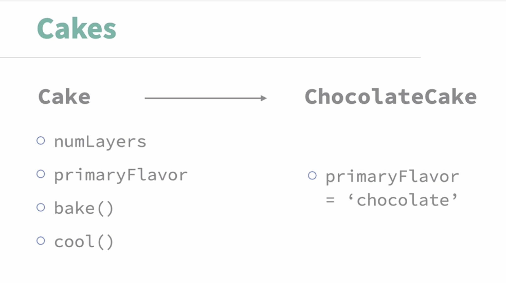

# Here are the key takeaways from the video on "Object-oriented JavaScript: Prototypes and classes":

**- Object-Oriented Programming (OOP):** JavaScript uses objects to bundle related data and functions, enabling code reuse through templates. This process is known as **encapsulation**.

**- Prototypal Inheritance:** JavaScript links objects to parent objects via prototypes, forming a **prototype chain** for inheritance.

**- Class Syntax:** ECMAScript 6 introduced the `class` keyword, providing a more familiar syntax for developers with OOP experience, though it still uses prototypes under the hood.

These points highlight how JavaScript handles object-oriented programming and inheritance.

## Cakes

***Cake***
- numLayers *(data)*
- primaryFlavour *(data)*
- bake() *(method)*
- cool() *(method)*

We can now easily create a new instance, ***ChocolateCake*** that uses as template ***Cake***

This is how you would add a method to an object using its **prototype**, which makes it available to all objects that use that prototype wherever they are down the chain.

In ECMAScript 6, there's a way of building these objects that looks more like the syntax of other programming languages, particularly the `class` keyword.

Along with being a little less verbose looking, it allows developers with previous object-oriented experience to feel more comfortable in JavaScript. 

That said, ultimately, this will still get turned into the prototype based declaration we saw before. Because these are enhancements to the way the language looks but don't really change how it works underneath, additions like this are often called **syntactic sugar**.

